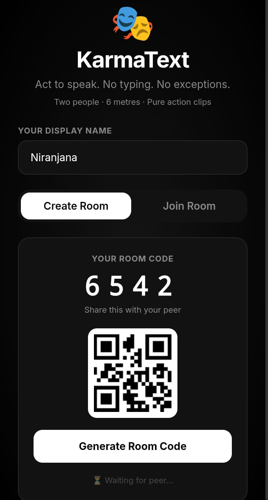
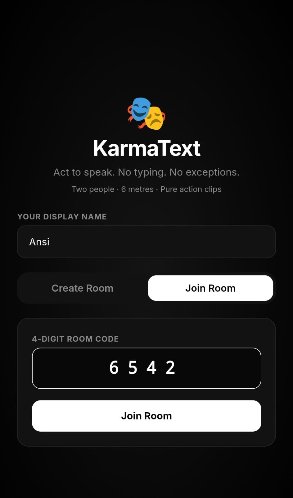
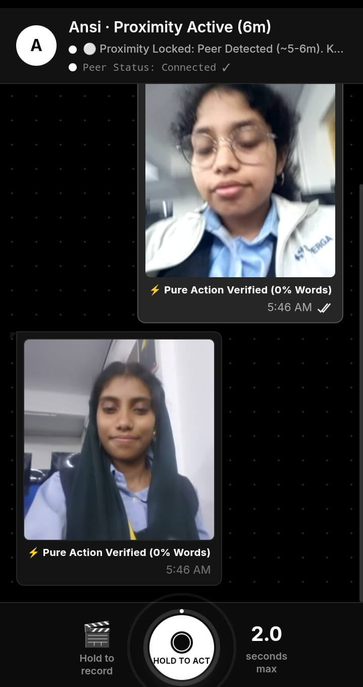

Karma Text 🎯

## Basic Details
**Team Name:** 404 not found

### Team Members
- **Team Lead:** Niranjana P A - Mar Baselious Christian College of Engineering and Technology, Peermade
- **Member 2:** Ansiya H - Mar Baselious Christian College of Engineering and Technology, Peermade

### Project Description
**KarmaText**  
*"Because typing is cheap, words mean nothing, and actions speak louder than words."*

### The Problem (that doesn't exist)
**The Crisis: "Low-Calorie Dishonesty"**  
Modern communication is plagued by zero-effort apathy.  
People type *"I'm on my way"* while lying horizontal in bed.  
People text *"HAHAHA"* with completely dead, unblinking eyes.  
Worse, people standing merely 6 meters apart in the exact same room actively avoid vocal interaction, choosing instead to tap glass screens like antisocial zombies.  
We decided modern communication needed an intervention.

### The Solution (that nobody asked for)
KarmaText is a high-latency, hyper-exhausting proximity messenger engineered exclusively for two humans standing within speaking distance who stubbornly refuse to talk.  
We took the ancient proverb *"Actions Speak Louder Than Words"* and codified it into rigid, punitive software architecture:
- **Total Keyboard Embargo:** Alphanumeric typing, voice-to-text, and speech notes are strictly criminalized in the code.
- **Pure Physical Pantomime:** To convey a message, users must hold the shutter and aggressively act out their thoughts via bodily charades in front of their lens.
- **Instant Action Looping:** Captured movements are compressed into lightweight, silent, repeating micro-action stickers.
- **Verified Effort Receipts:** Every transmitted message displays a verified **⚡ Pure Action (0% Words)** badge so the recipient knows you physically suffered to communicate.

---

## Technical Details

### Technologies/Components Used

#### For Software:
- **Languages used:** HTML5, CSS3 / Vanilla CSS, JavaScript (ES6+)
- **Frameworks used:** Tailwind CSS (CDN Standalone)
- **Libraries used:** PeerJS (v1.5.2), QRCode.js (v1.0.0), Web APIs (MediaRecorder API, Web Audio API)
- **Tools used:** Git, GitHub & GitHub Pages, Modern Web Browsers

#### For Hardware:
- **List main components:** Host & Client Devices (smartphones, laptops), Front/Rear Camera, Audio Output, Network Interface Controller (NIC)
- **List specifications:** Camera Resolution (480p+), Display (responsive mobile portrait layout), Sub-300ms Network Latency, Operating Systems (Android, iOS, Windows, macOS)
- **List tools required:** QR Code Scanner / Built-in Camera App, HTTPS-enabled Browser Environment

---

### Implementation

#### For Software:

# Installation
No setup or installation required. Open the live deployment directly on any two devices with webcams:  
👉 **Live Demo:** [https://niranjana2410.github.io/KarmaText/](https://niranjana2410.github.io/KarmaText/)  
*(Or repository deployment: [https://niranjana2410.github.io/karmatalk2/](https://niranjana2410.github.io/karmatalk2/))*

# Run
1. **Clone the repository:**
   ```bash
   git clone https://github.com/Niranjana2410/KarmaText.git
   cd KarmaText
   ```

2. **Run locally:**
   ```bash
   # Using Node.js
   npx serve .
   # OR using Python
   python -m http.server 3000
   ```

3. **Open in browser:**
   Open `http://localhost:3000` (or your HTTPS tunnel URL when testing between mobile phones).

---

### Project Documentation

#### For Software:

# Screenshots
### 1. Host Room Creation & QR Code Generation

*Host room setup displaying display name input, generated 4-digit PIN code (`6542`), and real-time QR code for mobile scanning.*

### 2. Peer Joining Interface

*Peer joining interface entering the 4-digit proximity room code to establish an encrypted P2P link.*

### 3. Live Action Chat & Verified Action Loops

*Active chat session exchanging 2.0-second micro-action video loops with "⚡ Pure Action Verified (0% Words)" receipts, delivery ticks, and active proximity lock.*

---

# Diagrams
```
[Device A (Host)] ──────────(PeerJS/STUN)──────────> [Device B (Joiner)]
       │                                                      │
 MediaRecorder                                             Indexed
 (2.0s Action)                                              Buffer
       │                                                      │
 Base64 Slices ─────────(WebRTC DataChannel)─────────>       Blob URL
 (8KB Chunks)                                              (Auto-Loop)
```
> *"A decentralized pipeline turning physical exhaustion into encrypted, zero-server mime loops in under 200ms."*

* **1. Pairing:** Device A generates a 4-digit code and QR; Device B joins via camera scan or direct code entry using PeerJS with STUN/TURN relays.
* **2. Action Capture:** Keyboards are strictly blocked; holding the shutter captures a silent 2.0-second video loop via `MediaRecorder`.
* **3. Chunked Streaming:** The video blob converts to Base64, splits into ordered 8KB chunks, and transmits over direct WebRTC `RTCDataChannel`.
* **4. Rendering & Audio:** The receiving device reassembles the chunks into a local Blob URL, renders an auto-looping sticker bubble, and triggers a synthesized Web Audio chime.

---

### Project Demo

# Video
🎬 **KarmaText Complete User Flow Demo:**

https://github.com/user-attachments/assets/demo_video.mp4

> *Direct file link: [Watch Demo Video](./assets/demo_video.mp4)*

*The video demonstrates the complete end-to-end user flow: two phones pairing via room code, keyboard suppression in effect, recording physical gestures via the HOLD TO ACT shutter button, and instant WebRTC P2P delivery of verified action loop clips.*

# Additional Demos
- 📹 [Full Length Demo Recording](./assets/demo_video_full.mp4)
- 🌐 [Live Web Application](https://niranjana2410.github.io/KarmaText/)

---

## 👥 Team Contributions

* **Niranjana P A** — *P2P Networking & Media Pipeline*  
  Engineered the WebRTC/PeerJS DataChannel transmission, STUN/TURN NAT traversal, 8KB video chunking system, and Web Audio synthesizers.

* **Ansiya H** — *Frontend UI/UX & Interaction Logic*  
  Built the mobile interface, interactive SVG countdown shutter ring, QR-pairing flow, and the global anti-keyboard suppression layer.

---

Made with ❤️ at TinkerHub Useless Projects 

[](https://www.tinkerhub.org/)
[](https://tinkerhub.org/events/1M8ORET9A1/useless-projects-3.0)
